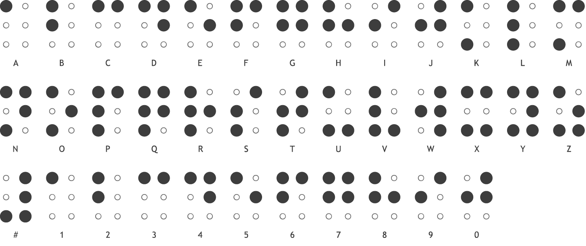

# Going Old School

## Description
Unable to use their RSA encryption program, **luciafer** resorts to using old school techniques to send a message out to the team. Can you decipher the code and find the flag?

`env.deadface.io`

## Solution
First look seems we have a Vigenere type table, an encrypted message and another message in braille along with a hostname.

Since Vigenere uses a key to crack we will start with the braille.

Using an image of braille we can decipher the text to be "PORT #47980"

Let us try to access the hostname with this port using netcat with the following command on linux

`nc env.deadface.io 47980`

This returns a string "GOBLINS"

Let us use try this as the key to the Vigenere cipher. To do this we can use an online decoder at dcode.fr/vigenere-cipher.

Doing this we see that it fails to crack the code. If we look back at the image we are provided we can see that the table list the alphabet in reverse order than a standard Vigenere cipher. Let us reverse the order of the alphabet on on the decoder and try again

GOBLINS: WE STRIKE TOMORROW
