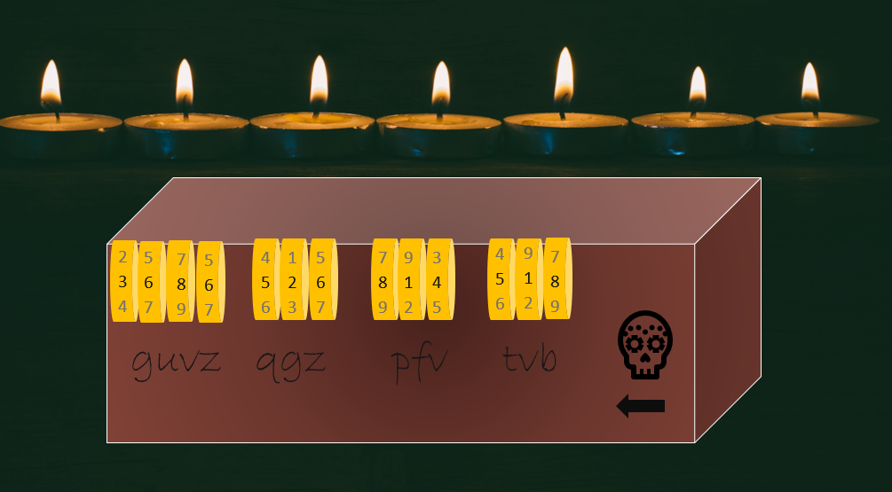

# Pandora's Box

## Description
Pandora's box, we have found it! Even better, the last travelers knew the numbered code to get in but they couldn't figure out the transcription. Figure out the the transcription's translation to find the flag!

## Solution
It seems we have an encoded message that needs to be cracked and we have a tumbler code that has already been set. When we have an encryption and numbers first item I try is a `ROT` cipher which is to rotate each letter a certain value up or down the alphabet to get a new letter.

Most simple `ROT` ciphers rotate each character the same amount but it seems like each letter lines up with a number on the tumber so we will rotate each letter the amount equivalent to the number above it. The final question is should we rotate up or down.

If we look at the image again we see a skull in the bottom right corner and an arrow pointing left. We can perceive this as telling us to rotate back down the alphabet.

Let us give this a try by manually changing each letter one by one.

| g | u | v | z |   | q | g | z |   | p | f | v |   | t | v | b |
| - | - | - | - | - | - | - | - | - | - | - | - | - | - | - | - |
| 3 | 6 | 8 | 6 |   | 5 | 2 | 6 |   | 8 | 1 | 8 |   | 5 | 1 | 8 |
| d | o | n | t |   | l | e | t |   | h | e | r |   | o | u | t |

Looked like we got a readable message of `dont let her out`

`flag{dont_let_her_out}`
