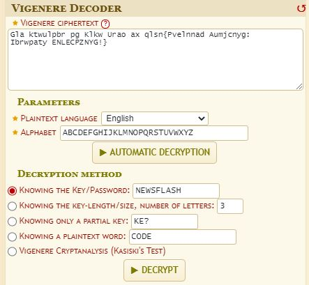
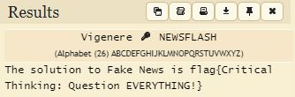

# Two Dead Boys

## Description
Good evening, this is a NEWSFLASH from Quick News Network (QNN)... I'm Crime News Reporter Frank Viginere.

> Ladies and gentleman skinny and scout I'll tell you a tale I know nothing about The admission is free so pay at the door Now pull out a chair and sit on the floor

> On one bright day in the middle of the night Two dead boys got up to fight Back to back they faced each other Drew their swords and shot each other

> The blind man came to see fair play The mute man came to shout hooray The deaf policeman heard the noise And came to stop those two dead boys

> He lived on the corner in the middle of the block In a two story house on a vacant lot A man with no legs came walking by And kicked the lawman in his thigh

> He crashed through a wall without making a sound Into a dry creek bed and suddenly drowned A long black hearse came to cart him away But he ran for his life and is still gone today

> I watched from the corner of the table The only eyewitness to facts of my fable If you doubt my lies are true Just ask the blind man, he saw it too

> Gla ktwulpbr pg Klkw Urao ax qlsn{Pvelnnad Aumjcnyg: Ibrwpaty ENLECPZNYG!}

> Submit the flag as flag{flag text}

## Solution
From the looks of things we have a story written by a Crim News Reporter named Frank Viginere. The end of the story we have a line of text with mixed up characters. Let us decrypt this text and get the flag.

Using the name of the reporter as a clue we can presume the cipher is the Viginere cipher. This cipher is performed with the use of a `key` value. To crack the cihper we will use an online site `https://www.dcode.fr/vigenere-cipher`.

The Viginere cipher can be broken through a brute force method but let us see if we can find any clues as to what the `key` could be from the information provided.

The word `NEWSFLASH` is all in caps and as such we can try this as our key. 

Accessing the `dcode.fr` webpage and plugging in the coded message and provided the `key = NEWSFLASH` let's see if we can decrypt the message.

Lets check the results to see if we got a readable answer.

Looks like we got the flag

`flag{Critical Thinking: Question EVERYTHING!}`
