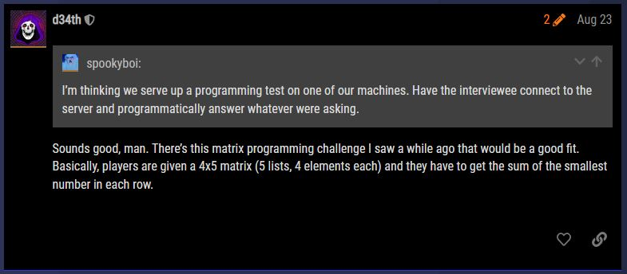
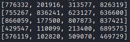

# Matrix

Turbo Tactical is looking to infiltrate DEADFACE. We know they're picky about whom they allow into their group, and recently they've started vetting new members. Our infiltrator needs your help solving a challenge on one of their remote servers. Check out Ghost Town for more information about what DEADFACE is looking for.

`code.deadface.io:50000`

Let us start by looking into Ghost Town and seeing if we can find a post related to vetting new members.


Here we see a post specifically about vetting. Looking inside we see discussions about a test for programmers. Further down the post we see the concept for the challenge..



Further down it is decided to add a time limit to the program so users can't manually solve the problem as well as the server side code provided by the creator. Looking into the code can assist with understanding how it is working but is not necessary for solving the challenge.

To begin let us create a simple script to create a socket connection to the server and retrieve the first bulk bytes to see what it looks like.

```Python3
#!/usr/bin/python3

import socket

client = socket.socket(socket.AF_INET, socket.SOCK_STREAM)

host = 'code.deadface.io'
port = 50000

client.connect((host,port))

print(client.recv(1024).decode('ascii'))

client.close()
```

Output shows us that we are receiving 5 arrays of 4 numbers one after another.



Let us trim up our recv and so we can focus on one line at a time. To do this we will limit the recv to 33 bytes giving us the entire length of each row. From there we will trim off the outside brackets and split the string on `', '` to give us a list of the 4 numbers. To do this for each line we will wrap this with a for loop ranging from 0 to 5.

Next we need to determine the lowest number of the list and sum them up with the lowest of the other list. To do this we will keep a global total value outside the loop and within the loop we will look for the lowest of each list as we loop and add it to the total as we go. When the loop exits we send the final total back to the server and perform a final receive to retrieve the flag from the server.

```Python3
#!/usr/bin/python3

import socket

client = socket.socket(socket.AF_INET, socket.SOCK_STREAM)

host = 'code.deadface.io'
port = 50000

client.connect((host,port))

total = 0
for x in range (0, 5):
    matrix = client.recv(33).decode('ascii')[1:-2]
    numbers = re.split(', ', matrix)
    total += int(min(numbers))
    
client.send(bytes(str(total), 'utf8'))
flag = client.recv(1024).decode('ascii')
print(flag)

client.close()
```

Let us execute our final script with python3. This prints to the page the flag retrieved from the server.

`flag{j4cked_int0_th3_matrix}`
